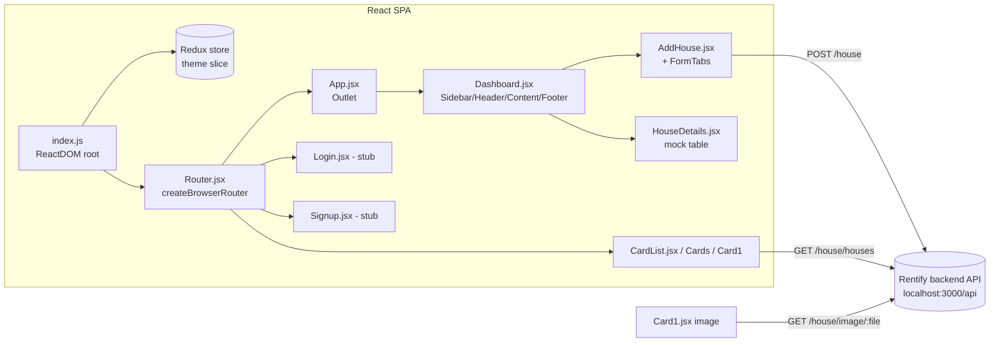
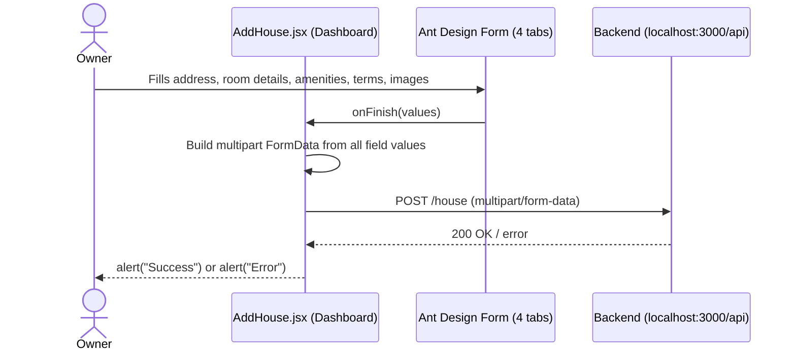

# Architecture

## System overview

Rentify Frontend is a single-page React application bundled with Parcel. There is no server-side
rendering or backend code in this repo — `index.js` mounts one React tree, wrapped in a Redux
`Provider` and an Ant Design `ConfigProvider` (dark theme algorithm), and `react-router-dom`'s
`createBrowserRouter` drives all navigation client-side. The app is organized around two user
types, each with their own folder: `HouseOwners` (dashboard, listing form, layout chrome) and
`Tenants` (property browsing cards). All data comes from a separate backend service reached over
plain HTTP.

## Component / system diagram

## Routing map

Defined in `src/Routes/Router.jsx`:

| Path | Component | Notes |
|---|---|---|
| `/` | `App` → `Dashboard` | Layout shell (sidebar/header/content/footer) |
| `/house` (nested under `/`) | `AddHouse` | Multi-tab property listing form |
| `/table` (nested under `/`) | `HouseDetails` | Renders **hardcoded** sample rows, not live data |
| `/login` | `Login` | Placeholder — renders literal text `hello` |
| `/signup` | `Signup` | Placeholder — renders literal text `Sign u page` |
| `/test` | `CardList` | Fetches and renders real property cards from the backend |

**Known bug:** the sidebar's "Test" link (`src/HouseOwners/Components/Sidebar/index.jsx`) points
to `/page`, which has no matching route — the actual `CardList` route is `/test`. Clicking that
sidebar link does not navigate anywhere useful.

## Folder-by-folder breakdown

| Path | Contents | Purpose |
|---|---|---|
| `src/Routes/Router.jsx` | One `createBrowserRouter` config | Single source of truth for all app routes |
| `src/App.jsx` | Root layout wrapper | Renders `<Outlet/>` for the router, plus global `App.css` reset |
| `src/HouseOwners/Pages/` | `Login`, `SignUp`, `Dashboard` | Top-level pages for the owner-facing side of the app |
| `src/HouseOwners/Components/Header,Sidebar,Content,Footer` | Ant Design `Layout` pieces | Compose the dashboard chrome; `Sidebar` also owns the nav menu |
| `src/HouseOwners/Components/AddHouse/` | `AddHouse.jsx` (form + submit), `FormTabs.jsx`, `PropertyAddress.jsx`, `RoomDetails.jsx`, `Amenities.jsx`, `Terms.jsx`, `UploadImage.jsx` | One Ant Design `Form` split across four tabs; `AddHouse.jsx` collects all field values into `FormData` and POSTs it |
| `src/HouseOwners/Components/HouseDetails/` | `HouseDetails.jsx` | Ant Design `Table` — currently mock data only, not wired to the backend |
| `src/HouseOwners/utility/axiosInstance.jsx` | One configured `axios` instance | `baseURL` from `constants.js`, 4s timeout, no auth headers |
| `src/HouseOwners/utility/constants.js` | `BACKEND_API`, `House_API` | Hardcoded `http://localhost:3000/api` base URL |
| `src/HouseOwners/utility/Functions.js` | `handleNumericInput`, `titleCase`, `required` | Small shared form-input helpers/validation rule |
| `src/HouseOwners/utility/Store/` | Redux Toolkit `configureStore` + `ThemeSlice` | Store is wired up in `index.js` but the `theme` slice is never read or dispatched anywhere in the app |
| `src/Tenants/Components/Cards/` | `Cards.jsx`, `Card1.jsx`, `CardList.jsx` | Tenant-facing property cards; `CardList` fetches `/house/houses` and renders results, `Card1` renders one property's carousel/price/description |

## Data flow: listing a new house

Note: the image upload widget inside the "Images" tab (`UploadImage.jsx`) is configured with
`action="https://660d2bd96ddfa2943b33731c.mockapi.io/api/upload"`, a public third-party mock API —
but `beforeUpload` always returns `false`, so Ant Design never actually calls that URL; the images
are instead collected into the same `FormData` and sent to the real backend in `AddHouse.jsx`'s
submit handler. This leftover `action` URL is dead configuration, not a real upload path.

## Known limitations

- **No authentication.** Login/Signup are placeholder pages; no token is stored or attached to any
  API request. Every route, including the property-submission form, is reachable without signing
  in.
- **No environment-based configuration.** The backend base URL (`http://localhost:3000/api`) is
  hardcoded in `constants.js` and duplicated inline in `AddHouse.jsx`, `Card1.jsx`, and `Cards.jsx`
  rather than centralized or read from an env var — pointing the app at a deployed backend
  requires editing source in multiple places.
- **Dead/unused code.** The Redux `theme` slice (`ThemeSlice.jsx`) is configured but never used;
  `House_API` is imported in `Card1.jsx` but never referenced; the sidebar's "Test" nav link
  targets a route (`/page`) that doesn't exist.
- **`CardList.jsx` renders the fetched properties four times in a row** (four separate `.map()`
  calls over the same `properties` array) rather than once — likely leftover from development/testing.
- **No tests and no CI configuration** anywhere in the repo.
- **`HouseDetails.jsx` (the `/table` route) shows static, hardcoded sample data**, not real
  listings from the backend.
